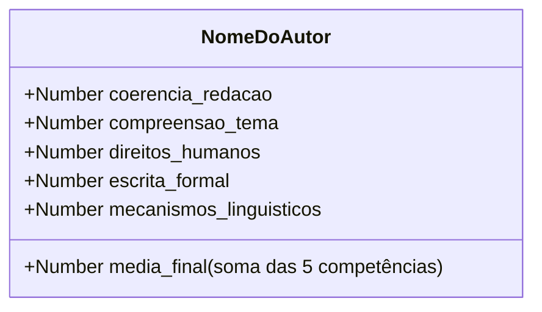
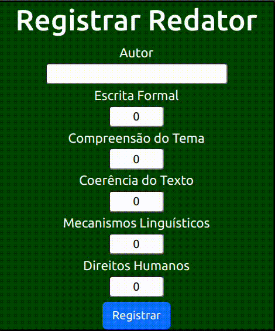
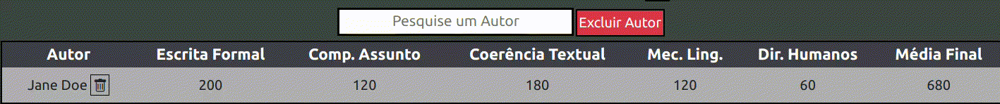

# Avaliador de Redações

## Descrição do Projeto
Este projeto tem como finalidade implementar, na prática, tecnologias de rotas (Vue Router) e uma estrutura de dados diferente das demais utilizadas

## Estrutura dos dados
No banco de dados do Firebase, os dados ficam armazenados da seguinte forma

## Guia de Utilização
### Atribuição de Pontuação
Nesta aplicação, a redação é avaliada em 5 competências, cada uma valendo de 0 a 200 pontos e a média final é a soma dessas pontuações (formando no máximo 1000)
### Registrando um Autor
Para registrar um autor, vá até o <a target="_blank" href="https://avaliadoronline.netlify.app/#/cadastro">Formulário de Registro</a> e preencha os campos  
 
</img>

### Excluindo um Autor
Há duas formas de excluir um autor, a viabilidade dependerá da quantidade de autores na lista
#### Usando o botão de lixeira
*Recomendável utilizar quando há poucos autores registrados*  

Clique no ícone de lixeira localizado após o nome do autor  
</img>

#### Pesquisando pelo nome
*Obs.: Caso sensitivo, RegEx será adicionado posteriomente*  

Digite o nome do autor no campo e clique em "Excluir Autor" (pressionar enter também funciona)
</img>

## Tecnologias Utilizadas

